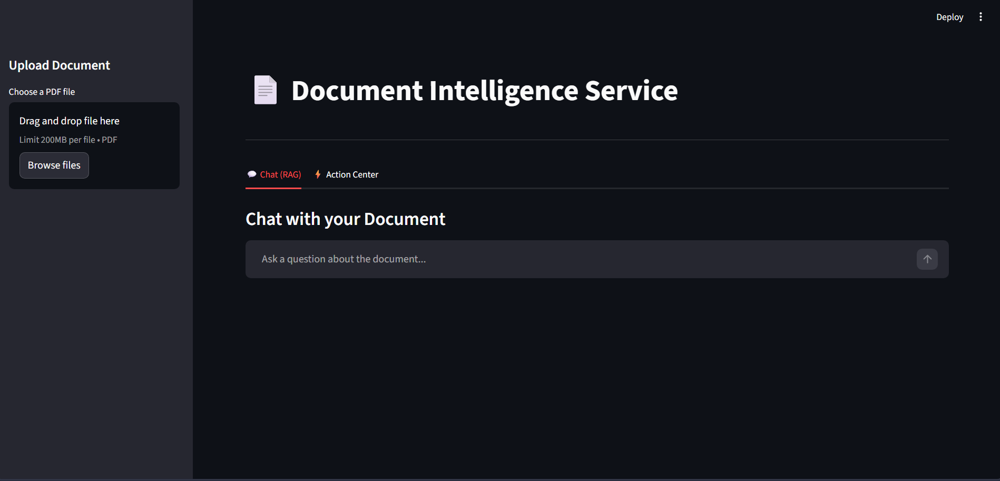
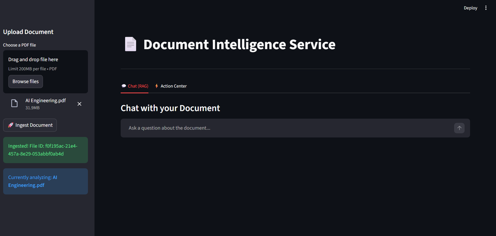
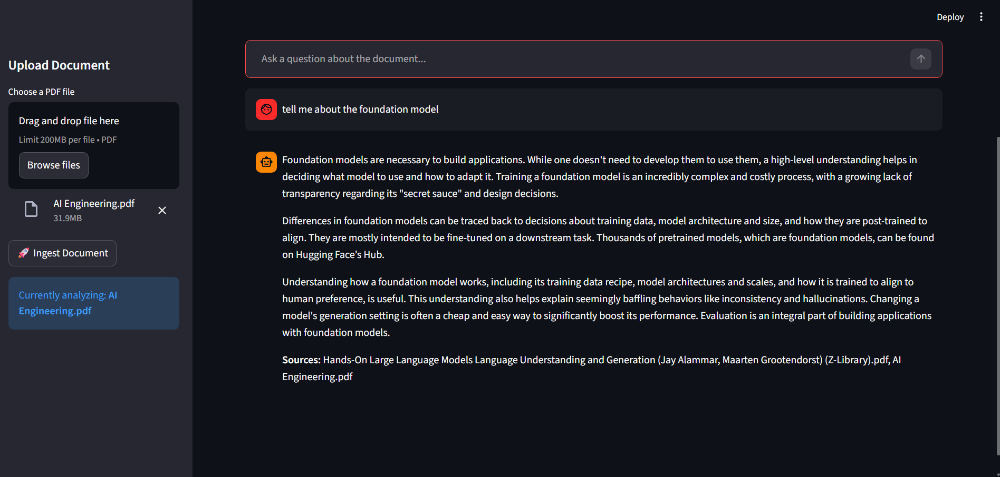

# 📄 Document Intelligence Service

An AI-powered document analysis platform that enables users to **chat with their PDFs** and automatically **extract actionable items** (deadlines, meetings, payments) using RAG (Retrieval-Augmented Generation) and local vector embeddings.



## 🚀 Features

- **Semantic Search**: Uses local HuggingFace embeddings (`all-MiniLM-L6-v2`) and FAISS for fast, reliable document retrieval.
- **AI Chat**: Interact with your documents in natural language via Gemini 2.5-Flash.
- **Action Extraction**: Automatically identifies and categorizes tasks, deadlines, and financial items.
- **Modern UI**: Clean, intuitive interface built with Streamlit.
- **FastAPI Backend**: Robust asynchronous API for document processing.



## 🛠️ Tech Stack

- **Frontend**: Streamlit
- **Backend**: FastAPI
- **LLM**: Google Gemini 2.5-Flash
- **Vector Store**: FAISS
- **Embeddings**: Sentence-Transformers (Local)
- **PDF Processing**: PyMuPDF



## 🏗️ Getting Started

### 1. Prerequisites
- Python 3.9+
- A Google Gemini API Key

### 2. Installation
1. Clone the repository:
   ```bash
   git clone <repository-url>
   cd "Document Intelligence Service"
   ```
2. Create and activate a virtual environment:
   ```bash
   python -m venv venv
   .\venv\Scripts\activate  # Windows
   source venv/bin/activate  # macOS/Linux
   ```
3. Install dependencies:
   ```bash
   pip install -r requirements.txt
   ```

### 3. Configuration
Create a `.env` file in the root directory:
```env
GEMINI_API_KEY=your_gemini_api_key_here
LLM_MODEL=gemini-2.5-flash
```

### 4. Running the App
1. **Start the Backend**:
   ```bash
   python main.py
   ```
2. **Start the Frontend**:
   ```bash
   streamlit run app.py
   ```

## ☁️ Deployment on Streamlit Cloud

For Streamlit Cloud deployment, ensure all packages in `requirements.txt` are listed. The app will automatically install them and download the necessary local embedding models during the first run.

---
*Created with ❤️ for intelligent document processing.*
